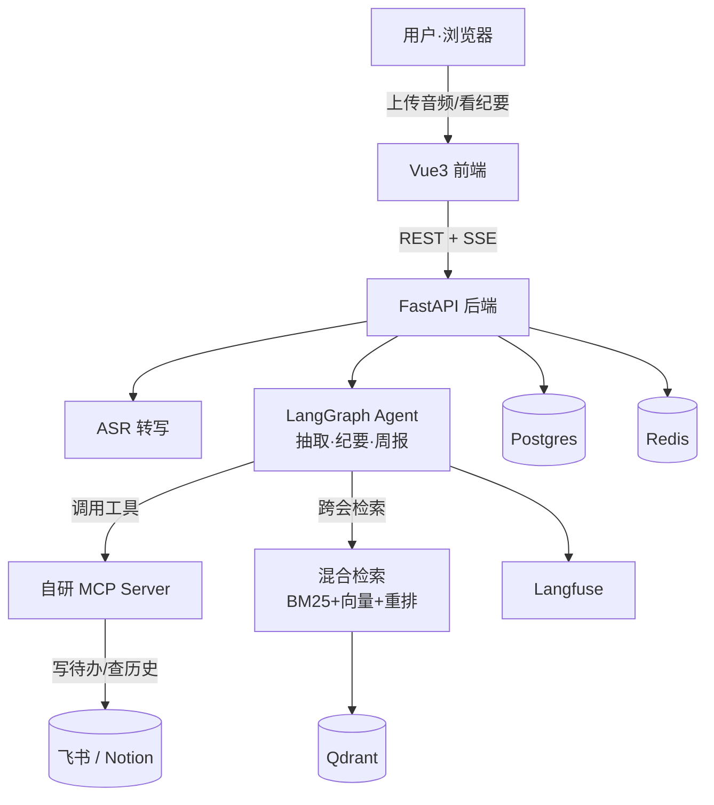

# 会议数字员工 (Meeting Intelligence Agent)

> 一个能听会、产出结构化纪要、自动抽取「决策 / 待办 / 风险」，并通过**自研 MCP server** 把待办回写进团队任务系统的会议数字员工，带端到端可观测性与自动化评测。

当前进度：**Phase 0 · 脚手架**（monorepo + 五服务一键起 + CI 骨架 + 前后端空壳）。

---

## 架构



| 服务 | 职责 | 端口 |
|---|---|---|
| backend (FastAPI) | API + 流式输出 | 8000 |
| postgres | 会议 / 待办 / 元数据 | 5432 |
| redis | 缓存 + 异步转写任务队列 | 6379 |
| qdrant | 历史会议向量库（跨会检索） | 6333 |
| langfuse | 可观测：agent 步骤 / 工具 / token | 3000 |

---

## 本地启动

### 1. 后端那套（Docker）

```bash
cp .env.example .env        # 首次需要；P0 阶段不填 key 也能起
docker compose up -d --build
docker compose ps           # 五个服务应为 Up / healthy
```

验证：
- 后端健康检查 → http://localhost:8000/health → `{"status":"ok"}`
- 后端 API 文档 → http://localhost:8000/docs
- Qdrant 控制台 → http://localhost:6333/dashboard
- Langfuse 控制台 → http://localhost:3000

停止：`docker compose down`（加 `-v` 连数据卷一起删）。

> 国内拉镜像若 TLS 超时：开代理，或在 Docker Desktop 配国内 registry mirror。

### 2. 前端（本地 dev）

```bash
cd frontend
npm install
npm run dev                 # http://localhost:5173
```

打开后点「测试后端连通」，能弹出 `{"status":"ok"}` 即表示 前端→开发代理→后端 链路通。

---

## 测试与 CI

```bash
# 后端
cd backend
pip install -r requirements-dev.txt
ruff check .
pytest -q
```

CI（GitHub Actions，见 `.github/workflows/ci.yml`）在 push / PR 时跑后端 lint+test 与前端 build。Phase 4 会加 eval gate。

---

## 目录

```
meeting-agent/
├── docker-compose.yml      # 五服务一键起
├── .github/workflows/      # CI
├── backend/                # FastAPI：api / asr / agent / retrieval / skills / db
├── mcp-server/             # ★ 自写 MCP server（Phase 2）
├── skills/                 # SKILL.md：站会/评审会/客户会（Phase 3）
├── eval/                   # ★ 标注集 + 评测脚本（Phase 4）
└── frontend/               # Vue3 + Vite + Element Plus
```

★ = 项目护城河。
