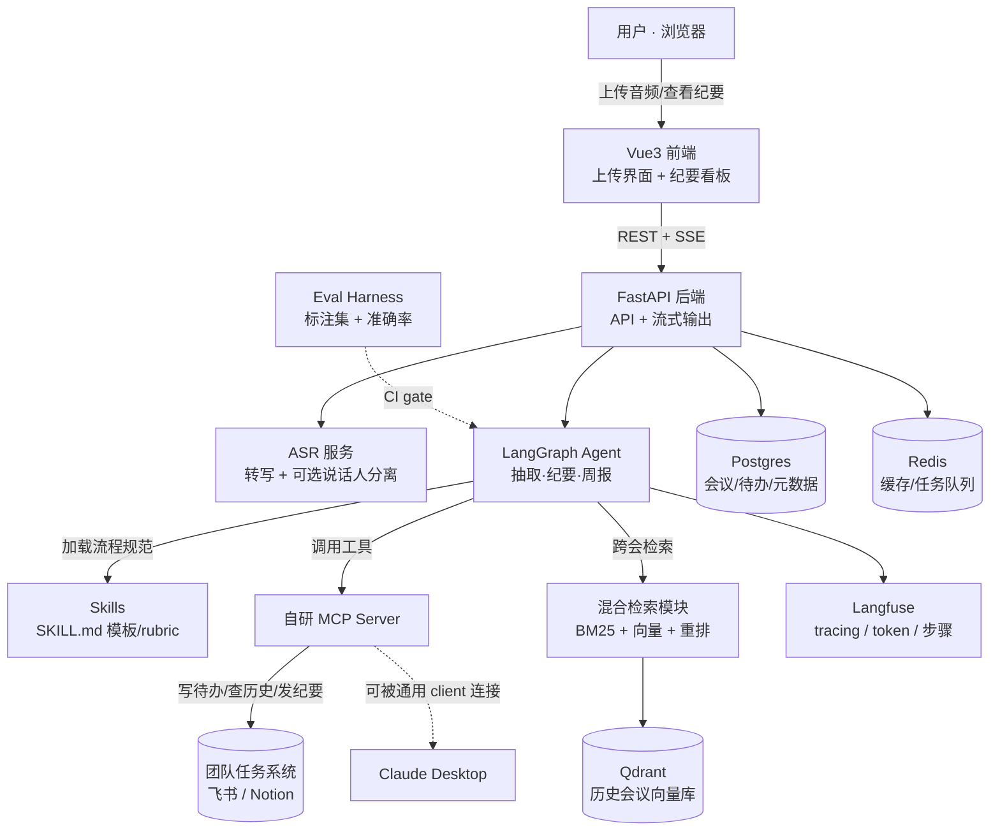

# 会议数字员工 (Meeting Intelligence Agent) · 项目 Kickoff

> 这是一份给 **Claude Code** 的项目说明书。喂给它之前，先读一遍最后两节
> 「给 Claude Code 的协作规范」和「你必须能讲清楚的清单」——它们决定了这个项目能不能在面试里扛住深挖。

---

## 0. 一句话定位（也是你简历/开场白该说的话）

> 一个能听会、产出结构化纪要、自动抽取「决策 / 待办 / 风险」，并通过**自研 MCP server** 把待办回写进团队任务系统的会议数字员工，带端到端可观测性与自动化评测。

每个词都站得住——它听着高端，是因为概念用对了，不是吹。

---

## 1. 范围红线（最重要的一节，AI 最容易在这里失控）

### ✅ 在范围内（MVP 必须有）
- 上传一段会议音频 → 转写文本
- LangGraph agent 从转写里抽取：**决策 / 待办(含负责人+ddl) / 风险 / 待议**
- 生成结构化会议纪要 + 一段「周报摘要」
- **自写 MCP server**，把核心能力暴露成 MCP tools，agent 通过它调用；并能接进 Claude Desktop 验证互操作
- 历史会议入向量库，支持「上次关于 X 我们定了什么」跨会检索
- Vue 前端：上传界面 + 纪要看板（决策/待办/风险分区，待办可点回原话出处）
- 一套 eval（抽取准确率 + 待办漏抽率）+ 可观测性(tracing) + Docker Compose 一键起 + CI

### ❌ 明确不做（落后时第一批砍掉，别让 AI 自作主张加）
- 多租户 / 复杂鉴权（最多留个假登录占位）
- 实时会议接入（只做「上传录音」，不做现场流式听会）
- 说话人分离精度调优（MVP 可先跳过 diarization，或只做粗粒度）
- 多语言、多 ASR 供应商切换
- 花哨的前端动效

**红线原则：宽度随便砍，深度和完整度不能砍。** 一个小而完整、能真跑的项目，远胜一个大而半成品。

---

## 2. 架构图



---

## 3. 技术选型

| 层 | 选型 | 说明 |
|---|---|---|
| 前端 | Vue 3 + Vite + **Element Plus** + Pinia | 组件库搭，别手搓；前端只调接口、不放业务逻辑 |
| 后端 | FastAPI + Uvicorn + **SSE 流式输出** | 你练过的，正好用上 |
| Agent 编排 | **LangGraph** + LangChain | 多步工作流：转写→抽取→纪要→周报 |
| LLM | 通义千问 / DeepSeek API（可配置） | 国内便宜稳定，extraction 够用 |
| ASR | **云 ASR API（默认，最省事）** / FunASR（本地中文，私有化备选） | MVP 先用云 API，diarization 可选 |
| 向量库 | Qdrant | 沿用你现有栈 |
| Embedding | BGE-M3 | 沿用 |
| 检索 | **BM25 + 向量混合 + 重排**（复用你现成模块） | 别重写，封装搬过来 |
| 关系库 | Postgres | 会议、待办、元数据 |
| 缓存/队列 | Redis | 转写任务异步化 |
| MCP | 官方 Python **MCP SDK**，自写 server | ← 护城河，必须自己写懂 |
| Skills | SKILL.md 文件，被 agent 按会议类型加载 | 站会/评审会/客户会各一套 rubric |
| 可观测 | **Langfuse**（开源可自部署） | 每个请求看到 agent 步骤、工具调用、token |
| Eval | 自写 harness + 小标注集（+ ragas 评检索） | 跑 before/after 数字 |
| 部署 | Docker Compose；云主机 / Railway | 一键起 |
| CI | GitHub Actions | lint + test + eval gate |

---

## 4. 目录结构（monorepo）

```
meeting-agent/
├── docker-compose.yml          # 一键起 FastAPI+Qdrant+Postgres+Redis+Langfuse
├── .github/workflows/ci.yml    # lint + test + eval gate
├── backend/
│   ├── app/
│   │   ├── main.py             # FastAPI 入口 + SSE
│   │   ├── api/                # 路由：上传、纪要、待办、检索
│   │   ├── asr/                # 音频→转写（+可选 diarization）
│   │   ├── agent/              # ★ LangGraph 图：抽取/纪要/周报（护城河）
│   │   ├── retrieval/          # ★ 复用的混合检索模块
│   │   ├── skills/             # SKILL.md 加载器
│   │   └── db/                 # Postgres / Qdrant / Redis 客户端
│   └── tests/
├── mcp-server/                 # ★ 自写 MCP server（护城河，独立可跑）
│   ├── server.py               # 工具：创建待办/查历史会议/发纪要
│   └── README.md               # 怎么接 Claude Desktop（面试演示用）
├── skills/                     # SKILL.md：standup / review / client 三套
├── eval/                       # ★ 标注集 + 评测脚本（护城河）
│   ├── dataset/                # 小标注集（10-20 段会议足够起步）
│   └── run_eval.py             # 抽取准确率 + 漏抽率，输出 before/after
├── frontend/                   # Vue3 + Vite + Element Plus
└── README.md                   # 架构图 + 设计权衡 + 量化结果（简历直链这里）
```

★ = 护城河，你必须边做边懂。

---

## 5. 数据流（端到端）

1. 用户上传音频 → 后端落盘，Redis 起异步转写任务
2. ASR 转写（可选 diarization 标说话人）→ 文本入 Postgres
3. 转写文本切块入 Qdrant（供日后跨会检索）
4. LangGraph agent 启动：按会议类型加载对应 Skill → 分段理解 → 抽取「决策/待办/风险/待议」→ 生成纪要 → 生成周报摘要
5. agent 经 **MCP server** 把待办写进飞书/Notion
6. 全程 trace 进 Langfuse
7. 前端看板渲染纪要，待办可点回原话出处

---

## 6. 分阶段任务（W1 = 7 天 MVP；W2 = 硬核化）

### Phase 0 · 脚手架（AI 全权包办）
- monorepo + docker-compose（5 个服务）+ CI 骨架
- **DoD**：`docker compose up` 全部起来，前端能打开空壳页

### Phase 1 · 转写闭环（AI 主导，你读）
- 上传 → 云 ASR → 转写文本 → 入库
- 把现成混合检索模块封装搬入 `retrieval/`，转写文本可被检索
- **DoD**：传一段音频出转写，且能检索到历史片段

### Phase 2 · 抽取 Agent + 自写 MCP（★ 你边做边懂）
- LangGraph 图：转写 → 抽取 决策/待办/风险/待议 → 纪要 → 周报
- 自写 MCP server，暴露「创建待办/查历史/发纪要」工具，agent 经它调用
- 接通 Claude Desktop 验证互操作，**单独录一个短 demo**
- **DoD**：一段会议 → 自动出纪要 + 待办进了任务系统；MCP 能被通用 client 连上

### Phase 3 · 前端 + Skills + 可观测（前端 AI 包办，Skills/可观测你读）
- Vue 上传界面 + 纪要看板（Element Plus）
- 3 个 SKILL.md（站会/评审会/客户会）接入 agent
- 接 Langfuse，每个请求能看完整 trace
- **DoD**：浏览器里完整走通一次，后台看到一条完整 trace

### Phase 4 · Eval + 交付（★ eval 你必须懂）
- 标注 10-20 段会议，写 `run_eval.py`，跑出抽取准确率/漏抽率的 before/after
- CI 加 eval gate
- README（架构图 + 设计权衡 + 数字）、3-5 分钟 demo、部署上线
- **DoD**：陌生人 clone 能跑；简历直链 repo + demo + eval 报告

**绝不能砍**：自写 MCP server、一个完整抽取闭环、eval 数字、能真跑的部署 + 一段真实 demo。

---

## 7. 给 Claude Code 的协作规范（贴在每次会话开头）

1. **小步快跑**：一次只实现一个 Phase 的一个子模块，跑通了再继续。禁止一口气生成几百行没验证的代码。
2. **每个模块带最小测试**，并告诉我怎么手动验证。
3. **关键设计决策要先解释再写**：涉及 `agent/`、`mcp-server/`、`eval/`、部署时，先用 2-3 句讲清「为什么这么设计、有什么替代方案、为什么没选它」，我确认后再写。
4. **不许扩范围**：第 1 节「范围红线」之外的功能，需要先问我。
5. **遇到选型分叉**（如 ASR 供应商、是否做 diarization）先列选项 + 取舍，不要替我默认。
6. 注释用中文，变量/函数用英文。

---

## 8. 你必须能讲清楚的清单（护城河自查 · 面试照这个深挖你）

做完每一项，问自己「能不能离开代码、在白板上给人讲明白」。讲不明白 = 还没做完。

**MCP server**
- [ ] MCP 是什么、解决什么问题，和「直接给函数」比强在哪
- [ ] 你的 server 暴露了哪些 tool、入参出参怎么设计的
- [ ] agent 怎么发现并调用这些 tool 的（协议握手大意）
- [ ] 为什么能被 Claude Desktop 这种通用 client 连上

**抽取 Agent（LangGraph 图）**
- [ ] 你的图有哪几个节点、为什么这么拆，状态怎么流转
- [ ] 抽取为什么不是「一个 prompt 全搞定」，分步的好处是什么
- [ ] 抽错/漏抽时你怎么定位是哪个节点的问题

**检索**
- [ ] 为什么混合检索（BM25+向量），各自补什么短板
- [ ] 重排在干嘛，没有它会怎样
- [ ] 跨会记忆是怎么实现的

**Eval**
- [ ] 你的准确率/漏抽率具体怎么算的、标注集怎么来的
- [ ] before/after 那个数字，「before」是什么基线
- [ ] 为什么把它接进 CI 当回归门禁

**部署/工程**
- [ ] 五个服务各自职责，为什么要 Redis、为什么要 Postgres
- [ ] 一个请求从上传到出纪要，链路上经过哪些组件

---

## 9. Demo 脚本要点（录给面试官 / 放简历）

1. 传一段真实风格的会议录音（30-60 秒即可）
2. 实时看转写 + 纪要生成（SSE 流式效果有 wow）
3. 切到看板，展示 决策/待办/风险 分区，点一个待办跳回原话
4. 切到飞书/Notion，展示待办已被 agent 自动写入
5. 打开 Claude Desktop，展示你的 MCP server 被通用 client 直接调用 ← 炸点
6. 亮一眼 Langfuse trace + eval 报告的 before/after 数字

---

## 10. 默认设定（想改告诉我）

- ASR：**云 API**（4 周/1 周都最省事）；私有化需求再换 FunASR
- 任务系统：**飞书**（国内投递最对味）；可换 Notion
- LLM：通义千问 / DeepSeek 可配置
- 可观测：Langfuse 自部署（开源，「企业级」观感好）
